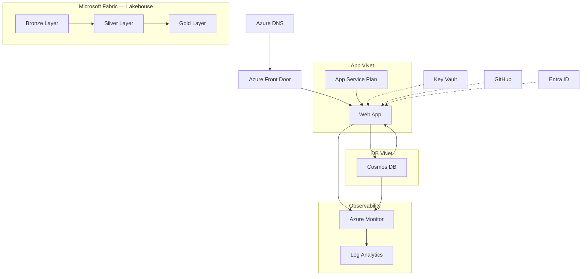

# Zava Architecture Diagrams

## 1. Current State Architecture

---

## 2. Target State — Agentic DevOps + AI Architecture

```mermaid
graph TD
    DEV["Developer"] -->|VS Code + Copilot extension| COP["GitHub Copilot"]
    DEV -->|GitHub.com| GHE["GitHub Enterprise"]

    COP -->|code gen, review, refactor| GHE
    GHE -->|CI/CD pipelines| GHA["GitHub Actions"]
    GHE -->|secret scanning, SAST, SCA| GHAS["GitHub Advanced Security"]

    GHA -->|deploy containers| ACR["Azure Container Registry"]
    ACR -->|AcrPull RBAC| APP["App Service<br/>(Linux Container)"]
    APP --> APPINS["Application Insights"]

    subgraph Foundry["Azure AI Foundry — westus3"]
        HUB["AI Hub"]
        PROJ["AI Project"]
        GPT4["GPT-4 deployment"]
        PHI["Phi deployment"]
        HUB --> PROJ
        PROJ --> GPT4
        PROJ --> PHI
    end

    APP -->|AI calls| HUB
    AGENT["AI Agents<br/>(code review, infra, monitoring)"] --> GHE
    AGENT --> HUB

    subgraph Lakehouse["Microsoft Fabric — Lakehouse (read-only)"]
        BRZ["Bronze"] --> SIL["Silver"] --> GLD["Gold"]
    end

    PROJ -->|read-only queries| BRZ
    KV["Key Vault"] -.->|secrets| APP
    KV -.->|secrets| GHA
    EID["Entra ID"] -.->|RBAC| APP
    EID -.->|RBAC| GHE
    EID -.->|RBAC| HUB
```

---

## 3. SDLC Whiteboard — GitHub Workflow Steps Across SDLC Phases

> Modeled after the L300 GitHub Copilot & Platform workshop whiteboard template.  
> Row order matches the template: Prepare → Harden → Connect to Azure → Develop → Create Landing Zone (infra track runs in parallel below).  
> Each active cell contains sticky notes: 📋 **Tasks**, 🔧 **Tools**, ☁️ **Resources**, ✅ **Governance/RAI checks**.  
> Inactive phases are marked `·`.  
> *PAF key action IDs from the [GHE Platform Adoption Kit](https://github.com/customer-success-microsoft/ghe-platform-adoption-kit).*

| **GitHub Step** | 📅 **Planning** | 🔍 **Analysis** | 🎨 **Design** | 💻 **Development** | 🧪 **Testing** | 🚀 **Deployment** | 🛠️ **Maintenance** |
|---|---|---|---|---|---|---|---|
| **📦 Prepare GitHub Environment** *Set up the DevOps toolset* PAF: learn-design-and-plan-for-enterprise-onboarding · enterprise-account-setup · define-org-and-team-structure | 📋 Identify stakeholders (Tim, Lydia, Kian, Kadji) 📋 Configure GitHub Enterprise license & seats 📋 Draft spec, SDLC plan & README 📋 Define objectives and success criteria 📋 Define language standards: C#, JavaScript, or Python only 🔧 GitHub Enterprise 🔧 GitHub Projects (roadmap) 🔧 GitHub Issues | 📋 Run GHCP in Agent mode to explore codebase 📋 Install VS Code extensions 📋 Configure MCP CLI & Azure tools 📋 Identify tools, extensions, and integrations 📋 Enable Copilot across all surfaces: IDE, CLI, GitHub Workspace 📋 *(No AI engineers on staff — Copilot + AI Foundry abstractions bridge the gap)* 🔧 Visual Studio Code (IDE) 🔧 GitHub Copilot (IDE + CLI + github.com) 🔧 MCP CLI ☁️ Azure OAI/LLM, DB, Storage | 📋 Define org & team structure 📋 Configure SSO/SAML via Entra ID 📋 Set repo templates and CODEOWNERS 📋 Configure Copilot custom instructions to enforce coding standards 📋 Define Responsible AI (RAI) requirements ✅ Governance review checklist 🔧 GitHub Enterprise policies 🔧 Entra ID (SAML/SCIM) 🔧 GitHub Copilot | `·` | `·` | `·` | `·` |
| **🔒 Harden GitHub Environment** *Security, governance & compliance* PAF: implement-scaled-governance · adopt-pull-request-reviews | `·` | 📋 Define branch protection & ruleset strategy 📋 Plan Dependabot alert policy 📋 Identify sensitive data & secret types 📋 Define least-privilege scopes for AI agents (no write access to prod) 🔧 GitHub Enterprise policies 🔧 GitHub Issues (tracking) | 📋 Configure CODEOWNERS 📋 Enable Dependabot & secret scanning 📋 Define required status checks 📋 Set environment protection rules & required reviewers 📋 Scope agent permissions: read-only on Fabric Lakehouse, no OLTP access ✅ Agent safety gates: validate discount offers, restrict data exposure 🔧 GitHub Advanced Security 🛡️ Entra ID, Key Vault | 📋 Enable GHAS code scanning on every PR 📋 Enable push protection for secrets 📋 Enforce signed commits 📋 Adopt PR review & management strategy (address tech debt risk) 📋 Require human review gate on all Copilot-generated code before merge 🔧 GHAS (SAST, SCA) 🔧 GitHub Actions | 📋 Validate all security gates pass 📋 Run Responsible AI compliance checklist 📋 Governance sign-off 📋 Verify agent cannot expose internal sales data to customers ✅ Test Document reviewed 🔧 GHAS dashboards 🔧 Dependabot | `·` | `·` |
| **🔗 Connect GitHub to Azure** *Create a CI/CD workflow* PAF: optimize-system-integrations-workflows | `·` | `·` | `·` | 📋 Create GitHub Actions build workflow 📋 Configure OIDC federated identity (no long-lived secrets) 📋 Use ACR Tasks to build image — no local Docker required 📋 GHCP generates workflow YAML 🔧 GitHub Actions 🔧 Azure OIDC federation 🔧 GitHub Copilot | 📋 Test CI pipeline end-to-end 📋 Validate ACR image build succeeds 📋 Confirm OIDC auth works 📋 Validate environment secrets correctly scoped 🔧 GitHub Actions 🔧 ACR Tasks | 📋 Run full CD pipeline on merge to main 📋 Deploy container to App Service 📋 Verify App Service pulls from ACR via Managed Identity (AcrPull RBAC) 📋 Confirm Application Insights telemetry flowing 📋 Track DORA metrics (deployment frequency, lead time) 🔧 GitHub Actions 🔧 Azure RBAC (AcrPull) 🔧 Application Insights | 📋 AI Agents automate ops monitoring & alerting 📋 Dependabot keeps dependencies current 📋 Copilot assists with triage, patch, refactor 📋 Measure developer productivity & engagement 📋 Share success stories with stakeholders (Lydia, Kian) 🔧 Dependabot 🔧 GitHub Actions 🔧 AI Agents (ops automation) 🔧 Azure Monitor, Log Analytics |
| **✨ Develop: Add Features** *Create new functionality & update existing features* PAF: developer-learning-and-training · adopt-pull-request-reviews · drive-innersource-adoption | `·` | `·` | `·` | 📋 Write all code in C#, JavaScript, or Python only 📋 Implement AI interior design assistant chat UI 📋 Integrate Azure AI Foundry SDK — abstract model calls to avoid vendor lock-in 📋 Migrate ZavaStorefront .NET 6 → .NET 8 📋 Connect agents to Fabric Lakehouse (read-only, bronze/silver/gold tiers) 📋 Implement content safety & guardrails on customer-facing AI agent 📋 Add discount-offer validation: agent cannot issue unauthorized discounts 📋 Code review & refactor with GitHub Copilot — require senior engineer sign-off 📋 Use Copilot custom instructions to enforce team coding standards 📋 *(Tech debt mitigation: Copilot generates drafts; humans own understanding & approval)* 🔧 VS Code + GitHub Copilot (IDE, CLI, Workspace) 🔧 GitHub Codespaces 🔧 GitHub Issues + Projects ☁️ Microsoft Fabric Lakehouse (read-only) ☁️ Azure AI Foundry SDK | 📋 Copilot-assisted unit & integration test generation 📋 GHAS code scan on every PR 📋 Dependabot SCA check 📋 Validate AI agent responses against RAI guidelines 📋 Test content safety filters on customer chat agent 📋 Verify Fabric Lakehouse queries return no raw OLTP/sales data to customers ✅ No AI model lock-in: all model calls go through AI Foundry abstraction layer 🔧 GitHub Actions CI 🔧 GHAS, Dependabot | `·` | `·` |
| **☁️ Create Azure Landing Zone** *Configure the Azure resources you need* *(infra track — runs in parallel with Develop)* PAF: enterprise-account-setup · configure-iam | `·` | `·` | 📋 Design resource topology & naming convention 📋 Author Bicep modules: ACR, App Service Plan, App Service, AI Foundry Hub + Project, Application Insights 📋 Define Managed Identity & AcrPull RBAC strategy (no ACR admin user) 📋 Define azure.yaml for AZD 📋 Plan GPT-4 + Phi model deployments in westus3 🔧 AZD CLI 🔧 Bicep in VS Code 🔧 Docker extension in VS Code 🔧 GitHub Copilot (infra scaffolding) | 📋 Provision resource group in westus3 📋 Run `azd provision` dry-run & validate 📋 Wire `APPLICATIONINSIGHTS_CONNECTION_STRING` app setting 📋 Configure AI Foundry Hub + Project + model deployments 📋 GHCP Agent generates subscription info & resource configs ☁️ ACR (admin disabled, AcrPull via Managed Identity) ☁️ App Service Plan (Linux) ☁️ Azure AI Foundry (GPT-4, Phi — westus3) ☁️ Application Insights 🔧 AZD CLI, Azure CLI | 📋 Validate Bicep with `az deployment validate` 📋 Confirm all RBAC role assignments 📋 Test Managed Identity pull from ACR 📋 Verify AI Foundry model endpoints respond 🔧 AZD CLI 🔧 Azure Portal | 📋 Run `azd up` (full deploy to westus3) 📋 Verify all resources in single resource group 📋 Confirm App Insights live telemetry 📋 Confirm GPT-4 and Phi accessible from App Service 🔧 AZD CLI 🔧 GitHub Actions | `·` |

---

### Zava Objections → Whiteboard Response Mapping

| Zava Objection | Where It's Addressed |
|---|---|
| *"We have no AI engineers"* | Prepare — Copilot + AI Foundry SDK bridges the skills gap; Develop — team uses SDK abstractions, not raw model APIs |
| *"Don't want model lock-in"* | Develop — AI Foundry SDK abstraction layer; swap GPT-4 ↔ Phi or other models without code changes |
| *"LLMs saying inappropriate things"* | Harden — content safety gates & RAI checklist; Develop — content safety filters on customer agent |
| *"Agents deleting prod data or exposing internal data"* | Harden — agent least-privilege scopes, read-only Lakehouse access, no OLTP; Harden — discount-offer validation gates |
| *"Copilot generates code that increases technical debt"* | Harden — mandatory human review gate on Copilot-generated PRs; Prepare — Copilot custom instructions enforce standards |
| *"Code generation doesn't follow best practices"* | Prepare — Copilot custom instructions; Harden — PR review strategy + senior engineer sign-off required |

---

### Stakeholder → SDLC Step Mapping

| Stakeholder | Role | Primary SDLC Concern | Relevant Steps |
|---|---|---|---|
| **Lydia Bauer** | Enterprise IT Architect | Agentic DevOps, deployment agility | Prepare, Connect to Azure, Create Landing Zone |
| **Kian Lambert** | App Development Manager | Developer productivity, .NET migration, avoiding technical debt | Prepare, Harden, Develop |
| **Kadji Bell** | CISO / Platform Ops | Security automation, reduced monitoring burden, agent safety | Harden, Connect to Azure (Maintenance) |
| **Tim de Boer** | Marketing Manager | Customer AI agent, internal data analysis, access controls | Develop, Create Landing Zone |
